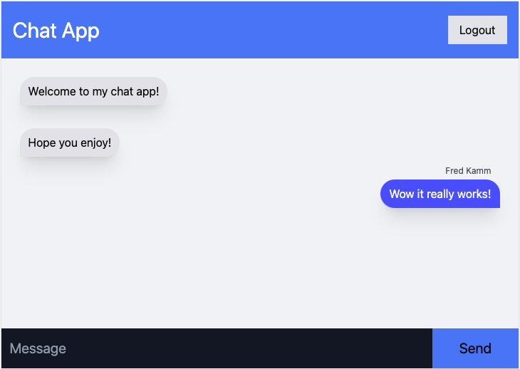

# Chat_App

This a chat app using firebase as the database.

# Inspiration

I need to explore more database options to use and building a chat app is good practice to understanding CRUD operations. (CREATE, READ, UPDATE, DELETE)

Though we can not delete or edit/update a post at the moment, we still demonstrate a successful create and read operations.

# Usage

    

        First sign in using your google account. Then you will have access to the chat!
    

    <a href="https://chat-app-a9849.firebaseapp.com/">
        Click here to visit my app!
    </a>

 

    

# Tools Used

- 
- 
- 

# Questions

    
Any questions or would like to collaborate Please shoot me an <a href="mailto:fred.kamm95@gmail.com"> Email </a>

    
If you would like to view more of my work  Visit my <a href="https://github.com/fredkamm ">Github</a> profile

